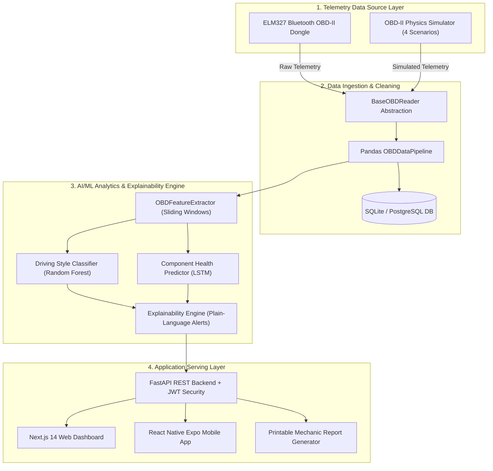

# ⚡ VehicleIQ — Real-Time Vehicle Health Prediction System

> **AI-powered vehicle health prediction system that learns from a user's personal driving behaviour via OBD-II sensor data and predicts component failures before they happen, in plain language.**

[](https://fastapi.tiangolo.com)
[](https://nextjs.org)
[](https://reactnative.dev)
[](https://scikit-learn.org)
[](https://tensorflow.org)
[](https://docker.com)

---

## 📐 System Architecture Diagram



---

## ✨ Project Highlights & Features

1. **OBD-II Real-Time Ingestion**: Connects to physical Bluetooth ELM327 dongles or emulates physics-backed telemetry across City, Highway, Sport, and Overheat driving scenarios.
2. **Behavioral Feature Engineering**: Extracts rolling hard braking events, high-RPM frequency ratios, idle time ratios, and thermal stress indices.
3. **Driving Style Classifier**: Random Forest sliding-window classifier categorizing driving styles (`Gentle`, `Moderate`, `Aggressive`) and calculating a 0-100 behavior score.
4. **LSTM Failure Prediction**: Sequential model estimating remaining health percentages (0-100%) for **Brake Pad Wear**, **Engine Stress**, and **Battery/Charging Health**.
5. **Plain-Language Diagnostics**: Converts numerical ML predictions into human-readable alerts with driver recommendations and mechanic summaries.
6. **Next.js Web Dashboard & Mobile App**: Modern dark-mode web dashboard and React Native (Expo) mobile app for live monitoring and mobile push notifications.
7. **Full MLOps Integration**: Docker Compose multi-container setup, Optuna hyperparameter optimization, MLflow experiment tracking, and GitHub Actions CI/CD.

---

## 🛠️ Technology Stack

| Layer | Technologies |
| :--- | :--- |
| **Telemetry & Ingestion** | Python, `python-OBD`, `pyserial`, Pandas, NumPy |
| **Machine Learning** | Scikit-learn, TensorFlow/Keras (LSTM), Optuna, MLflow, SHAP |
| **Backend API** | FastAPI, Uvicorn, SQLAlchemy, Pydantic V2, PyJWT, Passlib |
| **Web Dashboard** | Next.js 14, React 18, Glassmorphism Vanilla CSS, Lucide Icons |
| **Mobile App** | React Native, Expo SDK, `react-native-ble-plx` |
| **Databases** | SQLite (Dev), PostgreSQL 15 (Prod) |
| **DevOps & Cloud** | Docker, Docker Compose, Render, Vercel, GitHub Actions |

---

## 🚀 Quickstart & Local Setup

### 1. Clone & Install Dependencies
```bash
git clone https://github.com/your-username/VehicleIQ.git
cd VehicleIQ

# Create & activate virtual environment
python -m venv venv
source venv/bin/activate  # On Windows: venv\Scripts\activate

# Install dependencies
pip install -r requirements.txt
```

### 2. Run Database & Data Ingestion Test
```bash
# Ingest 30 simulated telemetry frames into local SQLite database
python main.py --mode simulation --scenario city_driving --count 30
```

### 3. Train ML Models & Generate Artifacts
```bash
python train_pipeline.py
```

### 4. Run FastAPI Backend API
```bash
uvicorn backend.app.main:app --reload --port 8000
```
- Interactive API Docs (Swagger UI): `http://localhost:8000/docs`

### 5. Run Next.js Web Dashboard
```bash
cd frontend
npm install
npm run dev
```
- Open `http://localhost:3000` in your browser.

---

## 🐳 Docker Compose Deployment

Spin up the complete multi-container stack (PostgreSQL + FastAPI + Next.js Dashboard):

```bash
docker compose up --build
```

- **Next.js Dashboard**: `http://localhost:3000`
- **FastAPI API**: `http://localhost:8000`
- **PostgreSQL Database**: `localhost:5432`

---

## 🧪 Running Automated Test Suite

```bash
# Run all Phase 1-4 unit and integration test suites
python test_pipeline.py
python test_phase2.py
python test_phase3.py
python test_phase4.py
```

---

## 🌐 Production Cloud Deployment

- **Backend API & PostgreSQL**: Configured for **Render.com** via `render.yaml`.
- **Frontend Dashboard**: Configured for **Vercel** via `vercel.json`.
- **CI/CD Pipeline**: Configured for **GitHub Actions** via `.github/workflows/deploy.yml`.

---

## 📜 License
Developed as a Final-Year Computer Science (AI/ML) Capstone Project. Open source under MIT License.
